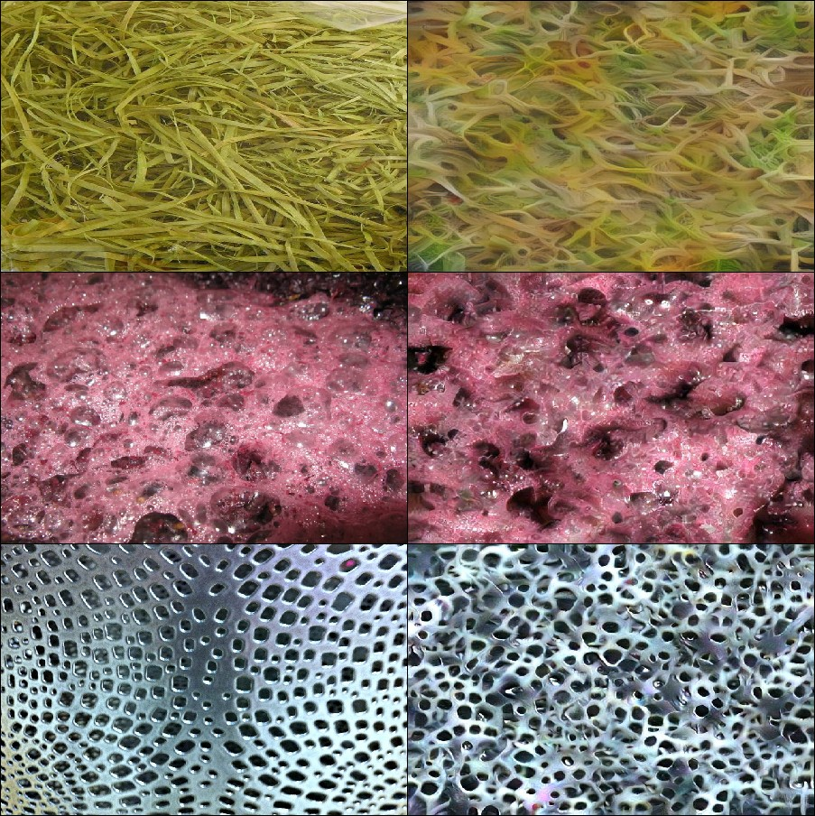
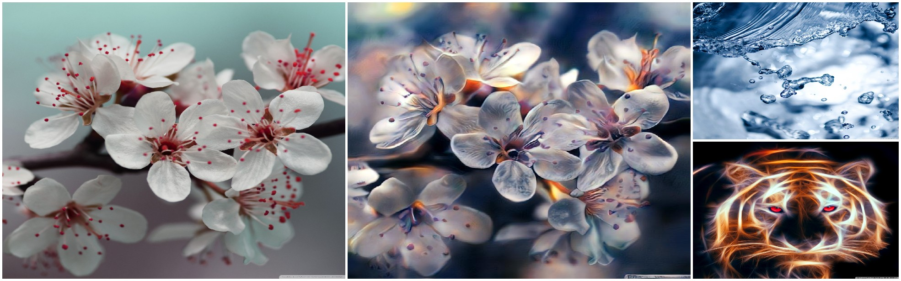
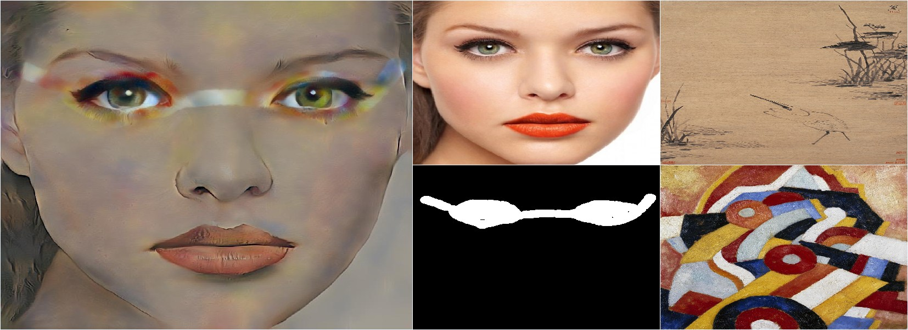

# deep-transfer

This is a Pytorch implementation of the "Universal Style Transfer via Feature Trasforms" NIPS17 [paper](https://arxiv.org/abs/1705.08086).

Given a __content image__ and an arbitrary __style image__,
the program attempts to transfer the visual style characteristics extracted from the style image to the content image generating __stylized ouput__.  

The core architecture is a VGG19 Convolutional Autoencoder performing 
Whitening and Coloring Transformation on the content and style features
in the bottleneck layer.   

## Installation
+ Needed Python packages can be installed using [`conda`](https://www.anaconda.com/download/) package manager by running `conda env create -f environment.yaml`

## Functionalities
Available modalities are:
+ __style transfer__ (inputs: a _content image_ and a _style image_);
   
  
+ __texture synthesis__ (inputs: a _texture style image_);
   

+ __style transfer interpolation__ (inputs: a _content image_ and _2 style images_);
   

+ __texture synthesis interpolation__ (inputs: _2 texture style images_);
   

+ __spatial control over stylization__ (inputs: a _content image_, a _binary mask_ of the same size and _2 style images_ for background-foreground stylization).
   

## Usage
`python main.py ARGS`

Possible ARGS are:
+  `-h, --help` show this help message and exit;
+  `--content CONTENT` path of the content image (or a directory containing images) to be trasformed;
+  `--style STYLE` path of the style image (or a directory containing images) to use;
+  `--synthesis` flag to syntesize a new texture. Must also provide a texture style image;
+  `--stylePair STYLEPAIR` path of two style images (separated by ",") to combine together;
+  `--mask MASK` path of the binary mask image (white on black) to use to trasfer the style pair in the corrisponding areas;
+  `--contentSize CONTENTSIZE` reshape content image to have the new specified maximum size (keeping aspect ratio);
+  `--styleSize STYLESIZE` reshape style image to have the new specified maximum size (keeping aspect ratio);
+  `--outDir OUTDIR` path of the directory where stylized results will be saved (default is `outputs/`);
+  `--outPrefix OUTPREFIX` name prefixed in the saved stylized images;
+  `--alpha ALPHA` hyperparameter balancing the blending between original content features and WCT-transformed features (default is `0.2`);
+  `--beta BETA` hyperparameter balancing the interpolation between the two images in the `stylePair` (default is `0.5`;)
+  `--no-cuda` flag to enable CPU-only computations (default is `False` i.e. GPU (CUDA) accelaration);
+  `--single-level` flag to use single-level stylization (default is `False`).

Supported image file formats are: __jpg__, __jpeg__, __png__.

